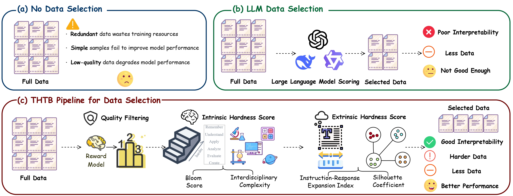
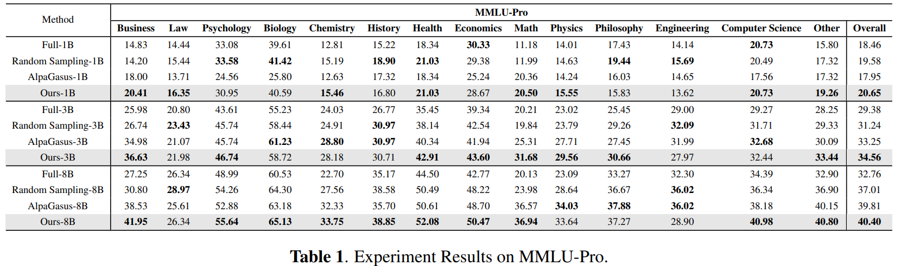
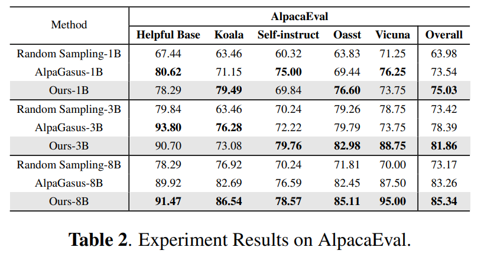
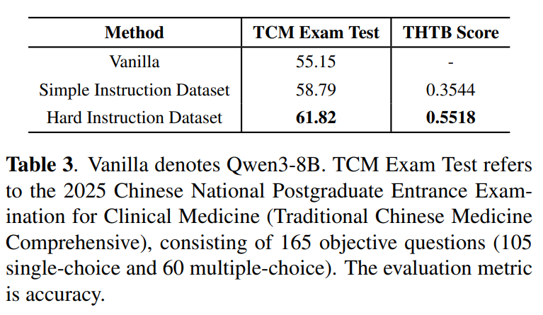

<h1 align="center">The Harder The Better: Maintaining Supervised Fine-tuning Generalization with Less but Harder Data</h1>

<p align="center">
     <br>
    Our method is called THTB, with the logo generated based on <a href="https://www.doubao.com/chat/">Doubao</a>.
</p>

<p align="center">
    <b>🌐 Language:</b> English | <a href="README_zh.md">中文</a>
</p>

## ⚡️ Overview

**THTB** is a general framework for instruction data selection and data annotation guidance proposed under the guidance of Bloom's Educational Taxonomy.

THTB contains three core selection stages:
1. **Quality Filtering**: Use reward models for initial data filtering to ensure basic data quality
2. **Intrinsic Hardness Screening**: Further filtering based on intrinsic hardness scores
3. **Extrinsic Hardness Screening**: Final filtering using extrinsic hardness scores

Through the three dimensions of "**Quality Filtering + Intrinsic Hardness + Extrinsic Hardness**", THTB focuses on selecting more complex and challenging instruction data to achieve efficient supervised fine-tuning (SFT) with stronger generalization capabilities. The figure (c) below shows the overall structure of the THTB method.

Through systematic experiments on **MMLU-Pro** and **Alpaca-Eval** benchmarks, we demonstrate that using THTB to select the top **5%** samples from the Alpaca dataset for SFT on Llama-3.2-1B-Instruct, Llama-3.2-3B-Instruct, and Llama-3.1-8B-Instruct significantly outperforms traditional approaches using the complete dataset.

Furthermore, our research in the **Traditional Chinese Medicine** domain further demonstrates the consistency of the THTB method in guiding data selection and data annotation.

<div align="center">
  
</div>

## 📚 Methodology

### Stage 1: Quality Filtering

To ensure basic data quality, we use the reward model [InternLM2-7B-Reward](https://www.modelscope.cn/models/Shanghai_AI_Laboratory/internlm2-7b-reward) from Shanghai AI Laboratory for initial screening of large-scale data.

#### 🔍 Model Features
- Trained on over **2.4 million** preference samples
- Covers multiple domains including **dialogue, writing, poetry, summarization, programming, mathematics**
- Balances performance with helpfulness/harmlessness
- Score range: **[-5, 5]**

#### 📊 Filtering Process
1. Generate quality scores for each `(query, response)` sample in the dataset

2. Sort in descending order by reward model scores

3. Retain the top **20%** of data to construct subset **a1**

   

### Stage 2: Intrinsic Hardness Score (IHS)

After obtaining the high-quality subset **a1**, continue screening based on the intrinsic hardness of samples.

#### 🧠 Core Components
The Intrinsic Hardness Score (IHS) consists of the following two dimensions:

- **📊 Bloom Score**: Cognitive level assessment based on Bloom's Taxonomy
- **🔗 Interdisciplinary Complexity (IC)**: Number of disciplines involved and semantic distance between disciplines

**Calculation Method**: Take the average of both to obtain IHS (Intrinsic Hardness Score), reflecting the intrinsic hardness of data.

#### 📊 Bloom Score

Based on Bloom's Taxonomy, we introduce Bloom scores to reflect the cognitive difficulty of data.

**Implementation Steps**:

1. Use large language models to classify each data sample to the corresponding cognitive level
2. Cognitive levels include: **Remember → Understand → Apply → Analyze → Evaluate → Create**
3. Calculate Bloom scores using the following formula:

$$
Bloom = \frac{\sum_{i = 1}^6 i \times \delta_{C_i} - Bloom_{min}}{Bloom_{max} - Bloom_{min}}
$$

Where δ<sub>C<sub>i</sub></sub> ∈ {0, 1} indicates whether the data belongs to the corresponding cognitive level. Bloom<sub>min</sub> and Bloom<sub>max</sub> represent the minimum and maximum Bloom scores in the dataset, respectively. ℂ represents the set of cognitive levels:

$$
C = \\{Remember, Understand, Apply, Analyze, Evaluate, Create\\}
$$

#### 🔗 Interdisciplinary Complexity (IC)

We propose Interdisciplinary Complexity (IC) to measure the difficulty of solving an instruction, based on the diversity of disciplines covered by the instruction and the span between disciplines. Specifically, the more disciplines an instruction involves and the greater the distance between these disciplines, the greater the difficulty of solving the instruction.

**Calculation Process**:
1. **Discipline Classification**: Use large language models to classify each data sample into relevant disciplines
2. **Discipline Description**: Generate detailed descriptions for each discipline
3. **Vectorization**: Use the [bge-large-en-v1.5](https://www.modelscope.cn/models/BAAI/bge-large-en-v1.5) model to obtain vector representations of discipline descriptions

For a given data sample *t*, represent the related disciplines as *s*<sub>1</sub>, *s*<sub>2</sub>, ..., *s*<sub>n</sub>. The corresponding discipline embedding set is represented as 𝕊<sub>t</sub> = { **s**<sub>1</sub>, **s**<sub>2</sub>, ..., **s**<sub>n</sub> }. The overall IC is calculated using the following formula:

$$
IC = \frac{|S_t| - |S_{min}|}{|S_{max}| - |S_{min}|} + \frac{\sum_{i=1}^{n-1} \sum_{j=i+1}^n Dist(s_i, s_j)}{C_{|S_t|}^2}
$$

Where $S_{min}$ and $S_{max}$ represent the sets with the minimum and maximum number of disciplines in the dataset, respectively. $C_{|S_t|}^2$ represents the number of combinations of selecting any two elements from $S_t$. $Dist(s_i, s_j)$ represents the distance calculation between discipline descriptions $s_i$ and $s_j$, with the formula as follows:

$$
Dist(s_i, s_j) = 1 - \frac{s_i \cdot s_j}{||s_i|| \cdot ||s_j||}
$$

#### 📈 Final Selection
By calculating the Bloom score and IC score for each data point, take the average of both as the **intrinsic hardness score**, sort in descending order, and select the top **50%** to construct subset **a2**.

### Stage 3: Extrinsic Hardness Score (EHS)

After obtaining subset **a2**, use extrinsic hardness scores for final screening.

#### 🎯 Core Components
The Extrinsic Hardness Score (EHS) consists of the following two dimensions:

- **📏 Instruction-Response Expansion Index (IREI)**
- **🔍 Silhouette Coefficient**

**Calculation Method**: Take the average of both to characterize the extrinsic hardness of data.

##### Instruction-Response Expansion Index (IREI)
The Instruction-Response Expansion Index reflects data difficulty through the length sum and ratio of responses to instructions: the longer the total length of instructions and responses, the more difficult it is for the model to learn; the higher the ratio of response length to instruction length, the more limited the context provided by the instruction, requiring more knowledge to solve the instruction. The specific calculation formula is as follows:

$$
IREI = \frac{L_{inst} + L_{resp} - L_{min}}{L_{max} - L_{min}} + \frac{L_{resp}}{L_{inst}}
$$

Where $L_\text{inst}$ and $L_\text{resp}$ represent the lengths of instructions and responses, respectively. $L_{\min}$ and $L_{\max}$ represent the shortest and longest length sums of instructions and responses in the dataset, respectively.

##### Silhouette Coefficient
Another goal of the extrinsic hardness score is to identify samples in the dataset that are both isolated and representative, as these samples are more likely to be unfamiliar to the model and thus bring greater learning challenges. To this end, we performed K-Means clustering on the dataset based on TF-IDF vector representations and evaluated each sample using the silhouette coefficient:

$$
SC = \frac{\alpha - \beta}{\max\{\alpha, \beta\}}
$$

Where $\alpha$ refers to the minimum value of the average distance from the current data vector to all data in other clusters, and $\beta$ refers to the average distance from the current data vector to other data within the cluster.

#### 📈 Final Selection
Calculate the average of the Instruction-Response Expansion Index and Silhouette Coefficient for each data point in subset **a2** as its **extrinsic hardness score**, select the top **50%** to construct subset **a3**, which is the final **THTB training set**.

---

## 📊 Experimental Validation

### 🔬 Experimental Setup

#### Base Models
- **Llama-3.2-1B-Instruct**
- **Llama-3.2-3B-Instruct** 
- **Llama-3.1-8B-Instruct**

#### Different Data Selection Strategies
- **Complete Alpaca Dataset**

- **THTB Filtered Dataset** (top 5% hard samples)

- **Random Sampling**

- **Alpagasus**

  > 📊 **Data Volume Control**: To ensure fair comparison, the data volumes of random sampling and Alpagasus methods are kept consistent with THTB filtering results.

#### Test Sets
- **MMLU-Pro**
- **Alpaca-Eval**

#### ⚙️ Training Configuration
- **Training Method**: LoRA fine-tuning

- **Learning Rate**: 1e-4

- **Batch Size × Gradient Accumulation Steps**: 4

- **Training Epochs**: 3

- **Random Seed**: 42

- **Evaluation Temperature**: 0 (ensuring result stability)

  

### 🏆 Main Results

#### 📊 MMLU-Pro Benchmark
**Table 1: MMLU-Pro Experimental Results** (values are accuracy rates for each subject)

<div align="center">
  
</div>

#### 🎯 Alpaca-Eval Benchmark
**Table 2: Alpaca-Eval Experimental Results**
- **Evaluation Metric**: Win rate relative to control model "trained with complete data"
- **Judge Model**: Qwen3-32B
- **Bias Elimination**: Answer positions randomly swapped during evaluation

<div align="center">
  
</div>

From the above two tables, we can see that whether on MMLU-Pro or Alpaca-Eval, our method achieves the best overall performance across all model scales: on MMLU-Pro, accuracy rates reach 20.65% (1B), 34.56% (3B), and 40.40% (8B); on Alpaca-Eval, win rates against full dataset models are 75.03% (1B), 81.86% (3B), and 85.34% (8B), respectively. Additionally, our method achieves the best results in most subjects of MMLU-Pro, especially excelling in cognitively demanding fields such as mathematics, chemistry, and biology. These results indicate that with the same data volume, a multi-stage selection mechanism that prioritizes high-difficulty training samples can significantly improve model generalization capabilities across different tasks, validating our core hypothesis: hard data is more valuable for model training.

Meanwhile, on MMLU-Pro, models trained with the complete dataset achieve the lowest performance at 3B and 8B scales, with accuracy of 29.38% and 32.76%, respectively. On Alpaca-Eval, for all model scales, every alternative method achieves win rates exceeding 50% compared to models trained with the complete dataset. This supports the "less is more" viewpoint: large amounts of unfiltered training data not only fail to effectively improve model capabilities but may actually harm generalization performance, while small amounts of higher-level data can better enhance generalization capabilities.

#### Guiding Vertical Domain Data Annotation

To evaluate the utility of THTB in guiding vertical domain data annotation, we conducted empirical evaluation in the Traditional Chinese Medicine domain.

First, we used Qwen3-32B to construct 10,000 instruction samples as a baseline dataset based on multiple Traditional Chinese Medicine gynecology textbooks. Then, under THTB guidance, we used the same model to construct 200 instruction samples with higher cognitive levels and greater difficulty. Finally, we performed supervised fine-tuning (SFT) on Qwen3-8B using these datasets respectively.

Results are shown in Table 3:

<div align="center">
  
</div>

Experiments show that the 200 higher-level instructions constructed under THTB guidance, despite being only 1/50 the size of the baseline dataset, achieved superior performance compared to the baseline. This result validates the effectiveness of THTB in guiding data annotation. Furthermore, the three-stage average normalized scores calculated using THTB indicate that the THTB-guided dataset has higher average hardness, validating the consistency of THTB in guiding data selection and data annotation.

> 📋 **Test Set Description**: The test set used in this experiment is derived from the 2025 National Postgraduate Entrance Examination for Clinical Medicine Comprehensive Ability (Traditional Chinese Medicine) questions. The data file is saved at `evaluation/2025年全国硕士研究生招生考试临床医学综合能力(中医综合).xlsx`.

## 🚀 Quick Reproduction

### 🛠️ Environment Dependencies

```bash
# Create and activate environment
conda create -n thtb python=3.10.12
conda activate thtb 
pip install -r requirements.txt
```

### 📊 Data Filtering

Execute the following command to implement the three-stage data filtering process of the THTB method:

```bash
python thtb.py \
    --input alpaca.xlsx \
    --output thtb.xlsx \
    --reward-model-path /path/to/internlm2-7b-reward \
    --bge-model-path /path/to/bge-large-en-v1.5 \
    --silhouette-clusters 161 \
    --verbose
```

#### 🔧 Core Parameter Description
| Parameter | Description |
|-----------|-------------|
| `--input` | Input dataset file path |
| `--output` | Final output file path |
| `--reward-model-path` | Reward model path |
| `--bge-model-path` | BGE model path |
| `--silhouette-clusters` | Number of silhouette coefficient clusters |
| `--verbose` | Show detailed progress information |

#### ⚙️ Optional Parameters
| Parameter | Description |
|-----------|-------------|
| `--quality-filter` | Quality filtering percentage |
| `--ihs-filter` | IHS filtering percentage |
| `--ehs-filter` | EHS filtering percentage |
| `--gpu` | GPU device ID |
| `--keep-temp` | Keep intermediate temporary files |

> 📁 **Output Result**: Filtered dataset `thtb.jsonl`, ready for subsequent fine-tuning

### 🎯 Model Training

#### 📥 Model Download

Before fine-tuning, please download the following pre-trained models and place them in the `model/` folder:

| Model | Link | Parameter Scale |
|-------|------|----------------|
| **Llama-3.2-1B-Instruct** | [🤗 HuggingFace](https://huggingface.co/meta-llama/Llama-3.2-1B-Instruct) | ~1B |
| **Llama-3.2-3B-Instruct** | [🤗 HuggingFace](https://huggingface.co/meta-llama/Llama-3.2-3B-Instruct) | ~3B |
| **Llama-3.1-8B-Instruct** | [🤗 HuggingFace](https://huggingface.co/meta-llama/Llama-3.1-8B-Instruct) | ~8B |
| **Qwen3-8B** | [🤗 HuggingFace](https://huggingface.co/Qwen/Qwen3-8B) | ~8B |

#### ⚙️ Training Configuration

The following is an example of key hyperparameter configuration for fine-tuning:

```bash
# Set model and output paths
MODEL=model/Llama3.1-8B          # Specify model path
OUTPUT_DIR=output/Llama3.1-8B    # Specify output path

# Start training
MASTER_PORT=29600 \
NPROC_PER_NODE=2 \
CUDA_VISIBLE_DEVICES=0,1 \
swift sft \
    --model ${MODEL} \
    --model_type llama3 \
    --train_type lora \
    --target_modules all-linear \
    --lora_rank 8 \
    --lora_alpha 32 \
    --torch_dtype bfloat16 \
    --num_train_epochs 3 \
    --per_device_train_batch_size 1 \
    --per_device_eval_batch_size 1 \
    --learning_rate 1e-4 \
    --gradient_accumulation_steps 4 \
    --save_strategy epoch \
    --logging_steps 1 \
    --max_length 8192 \
    --warmup_ratio 0.05 \
    --dataloader_num_workers 8 \
    --save_total_limit 3 \
    --save_only_model true \
    --output_dir ${OUTPUT_DIR} \
    --deepspeed zero3 \
    --use_liger_kernel true \
    --attn_impl flash_attn \
    --seed 42 \
    --dataset 'thtb.jsonl' \      # Specify dataset path
    --split_dataset_ratio 0.02
```

#### 📂 Training Scripts

We provide complete training script templates:

| Script File | Applicable Models | Description |
|-------------|-------------------|-------------|
| `train/run_llama3.sh` | Llama Series | Llama model fine-tuning script |
| `train/run_qwen3.sh` | Qwen Series | Qwen model fine-tuning script |

#### 🤖 Pre-trained Models

Models trained after filtering datasets using the THTB method have been published on the following platforms:

- **🤗 Hugging Face**: [DYJG-research](https://huggingface.co/DYJG-research)
- **🔬 ModelScope**: [DYJGresearch](https://modelscope.cn/profile/DYJGresearch?tab=model)

> 💡 **Special Note**: The repository also provides specialized models for THTB-guided vertical domain data annotation experiments

### 📊 Model Evaluation

#### 🧠 MMLU-Pro Evaluation

**Preparation**:
1. **Model Deployment**: Deploy the model to be evaluated
2. **Configuration Modification**: Modify API and client initialization configurations in the evaluation program
3. **Data Path**: Set the MMLU-Pro test set path

> 📁 **Data Location**: The MMLU-Pro test set provided by the project is located at `evaluation/MMLU-Pro-main/data/`

**Execute Evaluation**:
```bash
cd evaluation/MMLU-Pro-main
python mmlu_pro.py
```

#### 🦙 Alpaca-Eval Evaluation

##### Step 1️⃣: Environment Preparation

```bash
# Create dedicated environment
conda create -n alpacaeval python=3.10.12
conda activate alpacaeval
pip install alpaca-eval
```

##### Step 2️⃣: Model Inference

```bash
cd evaluation/Alpaca-Eval-main

# Set environment variables
CUDA_DEVICE=""                    # GPU device ID
BASE_MODEL="model/Llama3.1-8B-THTB"   # Base model path
OUTPUT_FILE="results/eval.json"  # Output file path
GENERATOR="Llama3.8-8B-THTB-eval"     # Generator name

# Execute inference
python3 eval_script.py \
    --cuda_device "$CUDA_DEVICE" \
    --base_model "$BASE_MODEL" \
    --output_file "$OUTPUT_FILE" \
    --generator "$GENERATOR"
```

##### Step 3️⃣: Model Comparison

```bash
python3 judge.py \
    --model1 ""                           # Model 1 path
    --model2 ""                           # Model 2 path
    --base_url "http://127.0.0.1:8004/v1" # Evaluator API address
    --merged_file ""                      # Merged file path
    --report_file ""                      # Report file path
```

##### Step 4️⃣: Result Statistics

> ⚠️ **Note**: Please modify the `RESULTS_FILE` variable in the script before execution

```bash
python statistics.py
```

---

## 📚 Citation

If you use THTB in your research, please cite our work:

```bibtex
@misc{thtb,
  title={The Harder The Better: Maintaining Supervised Fine-Tuning Generalization with Less but Harder Data},
  author={DYJG-research},
  year={2025},
  url={https://github.com/DYJG-research/THTB}
}
```

---
