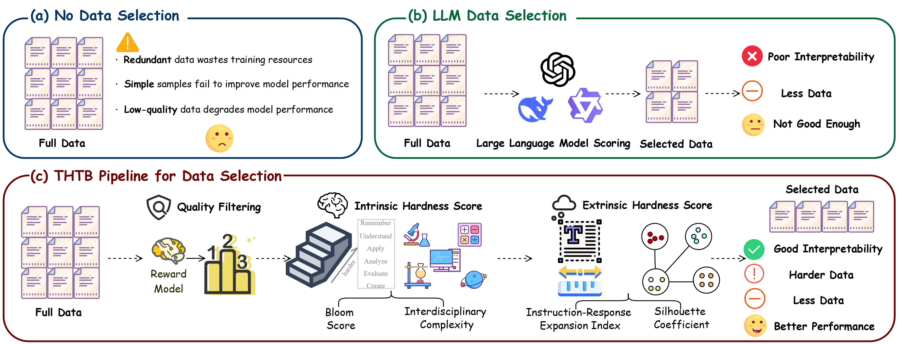
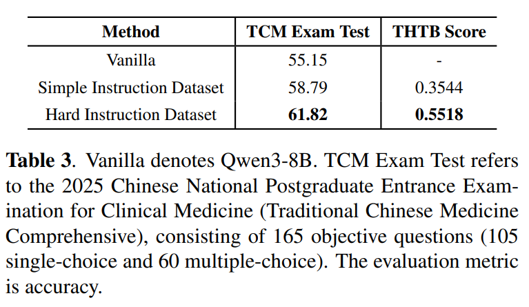

<h1 align="center">The Harder The Better: Maintaining Supervised Fine-tuning Generalization with Less but Harder Data</h1>

<p align="center">
     <br>
    我们的方法名为 THTB，Logo 基于 <a href="https://www.doubao.com/chat/">豆包</a> 生成。
</p>

<p align="center">
    <b>🌐 语言：</b> <a href="README.md">English</a> | 中文
</p>

## ⚡️ 概述

**THTB** 是在布鲁姆教育目标分类法指导下提出的一套用于指令数据筛选与数据标注指导的通用框架。

THTB 包含三个核心选择阶段：
1. **质量过滤**：使用奖励模型对数据进行初步过滤，确保数据基本质量
2. **内在难度筛选**：根据内在难度分数进行进一步过滤
3. **外在难度筛选**：使用外在难度分数完成最终过滤

通过"**质量过滤 + 内在难度 + 外在难度**"三个维度，THTB 专注于选择更复杂、挑战性更高的指令数据，以实现高效且具备更强泛化能力的有监督微调（SFT）。下图（c）展示了 THTB 方法的整体结构。

通过在 **MMLU-Pro** 与 **Alpaca-Eval** 基准上的系统实验，我们证明使用 THTB 从 Alpaca 数据集中精选的 **5%** 样本分别对 Llama-3.2-1B-Instruct、Llama-3.2-3B-Instruct 与 Llama-3.1-8B-Instruct 进行 SFT，其效果显著优于使用完整数据集的传统做法。

此外，我们在**中医药领域**开展的研究进一步证明了 THTB 方法用于数据选择和指导数据标注的一致性。

<div align="center">
  
</div>

## 📚 方法介绍

### 阶段一：质量过滤（Quality Filtering）

为确保数据基础质量，我们使用上海人工智能实验室的奖励模型 [InternLM2-7B-Reward](https://www.modelscope.cn/models/Shanghai_AI_Laboratory/internlm2-7b-reward) 对大规模数据进行初筛。

#### 🔍 模型特点
- 基于超过 **240 万**偏好样本训练
- 覆盖**对话、写作、诗歌、摘要、编程、数学**等多领域
- 兼顾性能与有益/无害平衡
- 评分范围：**[-5, 5]**

#### 📊 筛选流程
1. 为数据集中每个 `(query, response)` 样本生成质量分数

2. 按奖励模型得分降序排序

3. 保留排名前 **20%** 的数据构建数据子集 **a1**

   

### 阶段二：内在难度得分（Intrinsic Hardness Score）

在获得高质量子集 **a1** 后，继续基于样本的内在难度进行筛选。

#### 🧠 核心组成
内在难度得分（IHS）由以下两个维度组成：

- **📊 Bloom 得分**：基于布鲁姆分类法的认知层级评估
- **🔗 跨学科复杂度（IC）**：涉及学科的数量与学科间的语义距离

**计算方式**：两者取平均数，得到 IHS（Intrinsic Hardness Score），反映数据的内在难度。
#### 📊 Bloom Score

基于布鲁姆分类法，我们引入布鲁姆分数来反映数据的认知难度。

**实现步骤**：

1. 使用大型语言模型将每个数据样本分类至对应的认知层级
2. 认知层级包括：**Remember → Understand → Apply → Analyze → Evaluate → Create**
3. 按照以下计算公式得到 Bloom 得分：

$$
\begin{equation}
    Bloom = \frac{{\sum\limits_{i = 1}^6 {i \times {\delta _{{\mathbb{C}_i}}}}  - Bloo{m_{\min }}}}{{Bloo{m_{\max }} - Bloo{m_{\min }}}}
\end{equation}
$$
其中 δ<sub>C<sub>i</sub></sub> ∈ {0, 1} 表示数据是否属于相应的认知水平。Bloom<sub>min</sub> 和 Bloom<sub>max</sub> 分别表示数据集中的最小和最大布鲁姆分数。ℂ 表示认知水平集合：

$$
\begin{equation}
    \mathbb{C} = \{ {\text{Remember,Uderstand,Apply,Analyze,Evaluate,Create}}\}
\end{equation}
$$

#### 🔗 跨学科复杂度（Interdisciplinary Complexity, IC）

我们提出跨学科复杂性（IC）来衡量解决一条指令的难度，该指标基于指令所涵盖学科的多样性和学科间的跨度。具体而言，一条指令涉及的学科越多，这些学科之间的距离越大，解决该指令的难度就越大。


**计算流程**：
1. **学科分类**：使用大语言模型将每个数据样本分类到相关学科
2. **学科描述**：为每个学科生成详细的描述
3. **向量化**：使用 [bge-large-en-v1.5](https://www.modelscope.cn/models/BAAI/bge-large-en-v1.5) 模型获取学科描述的向量表征

对于给定的数据样本 *t*，将相关学科表示为 *s*<sub>1</sub>, *s*<sub>2</sub>, ..., *s*<sub>n</sub>。相应的学科嵌入集合表示为 𝕊<sub>t</sub> = { **s**<sub>1</sub>, **s**<sub>2</sub>, ..., **s**<sub>n</sub> }。整体 IC 使用以下公式计算：

$$
\begin{equation}
    IC = \frac{{|{\mathbb{S}_t}| - |{\mathbb{S}_{\min }}|}}{{|{\mathbb{S}_{\max }}| - |{\mathbb{S}_{\min }}|}} + \frac{{\sum\limits_{i = 1}^{n - 1} {\sum\limits_{j = i + 1}^n {Dist({{s}_i},{{s}_j})} } }}{{C_{|{\mathbb{S}_t}|}^2}}
\end{equation}
$$

其中 $\mathbb{S}_{min}>$和$\mathbb{S}_{max}$分别代表数据集中涉及学科数目最少和最多的集合。${C_{|{\mathbb{S}_t}|}^2}$代表从$\mathbb{S}_t$个元素中任选两个的组合数。${Dist({{s}_i},{{s}_j})}$代表计算学科描述$s_i$和$s_j$之间的距离，公式如下：


$$
\begin{equation}
    Dist({s_i},{s_j}) = 1 - \frac{{{s_i} \cdot {s_j}}}{{\left\| {{s_i}} \right\|\left\| {{s_j}} \right\|}}
\end{equation}
$$

#### 📈 最终筛选
通过计算每条数据的 Bloom 得分和 IC 分数，取二者的平均值作为**内在难度得分**，按降序排序后选取前 **50%** 构建数据子集 **a2**。

### 阶段三：外在难度得分（Extraneous Hardness Score）

获得数据子集 **a2** 后，使用外在难度得分进行最终筛选。

#### 🎯 核心组成
外在难度得分（EHS）由以下两个维度组成：

- **📏 指令-响应扩展指数（IREI）**
- **🔍 轮廓系数（Silhouette Coefficient）**

**计算方式**：两者取平均值，表征数据的外在难度。

##### 指令-响应扩展指数（IREI）
指令-响应扩展指数通过响应与指令的长度和比值来反映数据难度：指令和响应的总长度越长，模型学习越困难；响应与指令的长度比值越高，代表指令提供的上下文是有限的，解决该指令需要更多的知识。具体计算公式如下：

$$
\begin{equation}
    IREI = \frac{{{L_{{\text{inst}}}} + {L_{{\text{resp}}}} - {L_{\min }}}}{{{L_{\max }} - {L_{\min }}}} + \frac{{{L_{{\text{resp}}}}}}{{{L_{{\text{inst}}}}}}
\end{equation}
$$

其中，$L_\text{inst}$和$$L_\text{resp}$$分别代表指令和响应的长度。$L_{min}$和$L_{max}$分别代表数据集中指令和响应最短和最长的长度和。

##### 轮廓系数（Silhouette Coefficient）
外在难度得分的另一个目标是识别数据集中既孤立又具有代表性的样本，因为这些样本更有可能不为模型所熟悉，因此会带来更大的学习挑战。为此，我们基于数据集的 TF-IDF 向量表示 对数据集进行了 K-Means 聚类，并使用轮廓系数对每个样本进行了评估：

$$
\begin{equation}
    SC = \frac{{\alpha  - \beta }}{{\max \{ \alpha ,\beta \} }}
\end{equation}
$$

其中$\alpha$指的是当前数据的向量到其他簇所有数据的平均距离的最小值，$\beta$指的是当前数据的向量到簇内其它数据的平均距离。

#### 📈 最终筛选
计算 **a2** 数据子集中每条数据的指令-响应扩展指数和轮廓系数的平均值作为其**外在难度得分**，选取前 **50%** 构建数据子集 **a3**，即为最终的 **THTB 训练集**。

---

## 📊 实验验证

### 🔬 实验设置

#### 基础模型
- **Llama-3.2-1B-Instruct**
- **Llama-3.2-3B-Instruct** 
- **Llama-3.1-8B-Instruct**

#### 不同数据选择策略
- **完整 Alpaca 数据集**

- **THTB 筛选数据集**（前 5% 高难度样本）

- **随机采样**

- **Alpagasus**

  > 📊 **数据量控制**：为确保公平比较，随机采样和 Alpagasus 方法的数据量与 THTB 筛选结果保持一致。

#### ⚙️ 训练配置
- **训练方法**：LoRA 微调

- **学习率**：1e-4

- **批次大小 × 梯度累积步长**：4

- **训练轮数**：3

- **随机种子**：42

- **评估温度**：0（确保结果稳定性）

  

#### 主要结果

**表 1 为 MMLU-Pro 的实验结果（数值为各学科准确率）**
<div align="center">
  
</div>

**表 2 为 Alpaca-Eval 的实验结果**
**Table 2: Alpaca-Eval Experimental Results**
- **评价指标**: 相对“使用完整数据训练”的对照模型的胜率
- **评判模型**: Qwen3-32B
- **消除偏差**: 评测期间随机互换两个答案的位置
<div align="center">
  
</div>

从以上两个表格中我们可以看出，无论是在MMLU-Pro上，还是在Alpaca-Eval上，我们的方法在所有模型规模上都取得了最佳的整体性能：在MMLU-Pro上，准确率分别达到20.65%（1B）、34.56%（3B）和40.40%（8B）；在Alpaca-Eval上，对全数据集模型的胜率分别为75.03%（1B）、81.86%（3B）和85.34%（8B）。此外，我们的方法在MMLU-Pro的大多数科目中都取得了最佳成绩，尤其是在数学、化学和生物等对认知要求较高的领域表现尤为出色。这些结果表明，在数据量相同的情况下，优先选择高难度训练样本的多阶段选择机制可以显著提升模型在不同任务上的泛化能力。并且验证了我们的核心假说：高难度数据对模型训练更有价值。

同时，在MMLU-Pro上，使用完整数据集训练的模型在3B和8B规模上的表现均最差，准确率分别为29.38%和32.76%。在Alpaca-Eval上，对于所有模型规模，与使用完整数据集训练的模型相比，每种替代方法的胜率都超过了50%。这支持了“少即是多”的观点：大量未经过滤的训练数据不仅无法有效提升模型能力，反而可能损害泛化性能，少量高质量数据可以更好地提升泛化能力。

#### 指导垂直领域数据标注

为了评估 THTB 在指导垂直领域数据标注方面的效用，我们在中医药领域开展了实证评估。

首先，我们基于多本中医妇科教材，使用 Qwen3-32B 构建了 10,000 个指令样本作为基线数据集。然后，在 THTB 的指导下，我们利用同一模型构建了 200 个认知水平更高、难度更大的指令样本。最后，我们分别在这些数据集上对 Qwen3-8B 进行监督微调 (SFT)。

结果如表 3 所示：

<div align="center">
  
</div>

实验表明，在 THTB 指导下构建的 200 个高难度指令，尽管规模仅为基线数据集的 1/50，却取得了优于基线的性能。这一结果验证了 THTB 在指导数据标注方面的有效性。此外，使用 THTB 计算的三阶段平均归一化分数表明，THTB 指导的数据集具有更高的平均难度，验证了 THTB 方法用于数据选择和指导数据标注的一致性。

> 📋 **测试集说明**：该实验使用的测试集来源于 2025 年全国硕士研究生招生考试临床医学综合能力（中医综合）真题，数据文件保存在 `evaluation/2025年全国硕士研究生招生考试临床医学综合能力(中医综合).xlsx`。


## 🚀 快速复现

### 🛠️ 环境依赖

```bash
# 创建并激活环境
conda create -n thtb python=3.10.12
conda activate thtb 
pip install -r requirements.txt
```

### 📊 数据筛选

执行以下命令即可实现 THTB 方法三阶段的数据筛选流程：

```bash
python thtb.py \
    --input alpaca.xlsx \
    --output thtb.xlsx \
    --reward-model-path /path/to/internlm2-7b-reward \
    --bge-model-path /path/to/bge-large-en-v1.5 \
    --silhouette-clusters 161 \
    --verbose
```

#### 🔧 核心参数说明
| 参数 | 说明 |
|------|------|
| `--input` | 输入数据集文件路径 |
| `--output` | 最终输出文件路径 |
| `--reward-model-path` | 奖励模型路径 |
| `--bge-model-path` | BGE 模型路径 |
| `--silhouette-clusters` | 轮廓系数聚类数 |
| `--verbose` | 显示详细进度信息 |

#### ⚙️ 可选参数
| 参数 | 说明 |
|------|------|
| `--quality-filter` | 质量筛选百分比 |
| `--ihs-filter` | IHS 筛选百分比 |
| `--ehs-filter` | EHS 筛选百分比 |
| `--gpu` | GPU 设备 ID |
| `--keep-temp` | 保留中间临时文件 |

> 📁 **输出结果**：筛选后的数据集 `thtb.jsonl`，可直接用于后续微调

### 🎯 模型训练

#### 📥 模型下载

在微调前，请下载以下预训练模型并放入 `model/` 文件夹：

| 模型 | 链接 | 参数规模 |
|------|------|------|
| **Llama-3.2-1B-Instruct** | [🤗 HuggingFace](https://huggingface.co/meta-llama/Llama-3.2-1B-Instruct) | ~1B |
| **Llama-3.2-3B-Instruct** | [🤗 HuggingFace](https://huggingface.co/meta-llama/Llama-3.2-3B-Instruct) | ~3B |
| **Llama-3.1-8B-Instruct** | [🤗 HuggingFace](https://huggingface.co/meta-llama/Llama-3.1-8B-Instruct) | ~8B |
| **Qwen3-8B** | [🤗 HuggingFace](https://huggingface.co/Qwen/Qwen3-8B) | ~8B |

#### ⚙️ 训练配置

以下是微调的关键超参数配置示例：

```bash
# 设置模型和输出路径
MODEL=model/Llama3.1-8B          # 指定模型路径
OUTPUT_DIR=output/Llama3.1-8B    # 指定输出路径

MASTER_PORT=29600 \
NPROC_PER_NODE=2 \
CUDA_VISIBLE_DEVICES=0,1 \
swift sft \
    --model ${MODEL} \
    --model_type llama3 \
    --train_type lora \
    --target_modules all-linear \
    --lora_rank 8 \
    --lora_alpha 32 \
    --torch_dtype bfloat16 \
    --num_train_epochs 3 \
    --per_device_train_batch_size 1 \
    --per_device_eval_batch_size 1 \
    --learning_rate 1e-4 \
    --gradient_accumulation_steps 4 \
    --save_strategy epoch \
    --logging_steps 1 \
    --max_length 8192 \
    --warmup_ratio 0.05 \
    --dataloader_num_workers 8 \
    --save_total_limit 3 \
    --save_only_model true \
    --output_dir ${OUTPUT_DIR} \
    --deepspeed zero3 \
    --use_liger_kernel true \
    --attn_impl flash_attn \
    --seed 42 \
    --dataset 'thtb.jsonl' \      # 指定数据集路径
    --split_dataset_ratio 0.02
```

#### 📂 训练脚本

我们提供了完整的训练脚本模板：

| 脚本文件 | 适用模型 | 说明 |
|----------|----------|------|
| `train/run_llama3.sh` | Llama 系列 | Llama 模型微调脚本 |
| `train/run_qwen3.sh` | Qwen 系列 | Qwen 模型微调脚本 |

#### 🤖 训练模型

使用 THTB 方法筛选数据集后训练的模型已发布至以下平台：

- **🤗 Hugging Face**：[DYJG-research](https://huggingface.co/DYJG-research)
- **🔬 ModelScope**：[DYJGresearch](https://www.modelscope.cn/profile/DYJGresearch?tab=model)

> 💡 **特别说明**：仓库中还提供了 THTB 指导垂直领域数据标注实验的专用模型

### 📊 模型评测

#### 🧠 MMLU-Pro 评测

**准备工作**：
1. **模型部署**：部署待评测模型
2. **配置修改**：修改评测程序中的 API 和客户端初始化配置
3. **数据路径**：设置 MMLU-Pro 测试集路径

> 📁 **数据位置**：项目提供的 MMLU-Pro 测试集位于 `evaluation/MMLU-Pro-main/data/`

**执行评测**：
```bash
cd evaluation/MMLU-Pro-main
python mmlu_pro.py
```
#### 🦙 Alpaca-Eval 评测

##### 步骤 1️⃣：环境准备

```bash
# 创建专用环境
conda create -n alpacaeval python=3.10.12
conda activate alpacaeval
pip install alpaca-eval
```

##### 步骤 2️⃣：模型推理

```bash
cd evaluation/Alpaca-Eval-main

# 设置环境变量
CUDA_DEVICE=""                    # GPU 设备 ID
BASE_MODEL="model/Llama3.1-8B-THTB"   # 基础模型路径
OUTPUT_FILE="results/eval.json"  # 输出文件路径
GENERATOR="Llama3.8-8B-THTB-eval"     # 生成器名称

# 执行推理
python3 eval_script.py \
    --cuda_device "$CUDA_DEVICE" \
    --base_model "$BASE_MODEL" \
    --output_file "$OUTPUT_FILE" \
    --generator "$GENERATOR"
```

##### 步骤 3️⃣：模型比较

```bash
python3 judge.py \
    --model1 ""                           # 模型1路径
    --model2 ""                           # 模型2路径
    --base_url "http://127.0.0.1:8004/v1" # 评估器的API地址
    --merged_file ""                      # 合并后的文件路径
    --report_file ""                      # 报告文件路径
```

##### 步骤 4️⃣：结果统计

> ⚠️ **注意**：执行前请修改脚本中的 `RESULTS_FILE` 变量

```bash
python statistics.py
```

---

## 📚 引用

如果您在研究中使用了 THTB，请引用我们的工作：

```bibtex
@misc{thtb,
  title={The Harder The Better: Maintaining Supervised Fine-Tuning Generalization with Less but Harder Data},
  author={DYJG-research},
  year={2025},
  url={https://github.com/DYJG-research/THTB}
}
```

---

